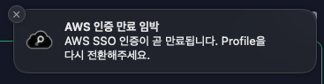

# Pronto

> macOS 메뉴바에서 AWS SSO 프로필을 전환하고 credential 만료를 모니터링하는 앱


---

## 주요 기능

- **원클릭 전환**: 메뉴바에서 AWS Profile 즉시 전환
- **자동 SSO 로그인**: Profile 전환 시 브라우저 자동 실행
- **만료 알림**: Credential 만료 5분 전 시스템 알림
- **즐겨찾기**: 자주 쓰는 Profile 관리
- **터미널 연동**: 열린 터미널 세션 자동 업데이트 (iTerm2/Terminal.app)
- **자동 업데이트**: GitHub Release 기반 원클릭 업데이트

**시간 절약**: Profile 전환 1-2분 → 3초 (97% 감소)

### Credential 만료 알림



AWS SSO credential 만료 5분 전 자동 알림

---

## 설치

```bash
# Homebrew
brew install --cask do-not-do-that/pronto/pronto

# Gatekeeper 해제
xattr -cr /Applications/Pronto.app
open -a Pronto
```

**요구사항**: macOS 13.0+, AWS CLI v2

---

## 사용법

1. 메뉴바 아이콘 클릭
2. Profile 선택
3. SSO 로그인 (자동)
4. 완료

새 터미널에서 바로 사용 가능. 기존 터미널은 `source ~/.pronto_profile`

---

## FAQ

[FAQ 문서](FAQ.md) 참고

---

## License

MIT License
